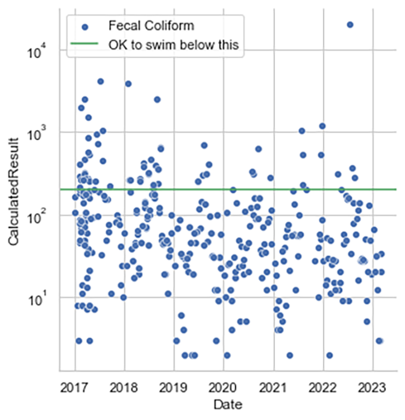
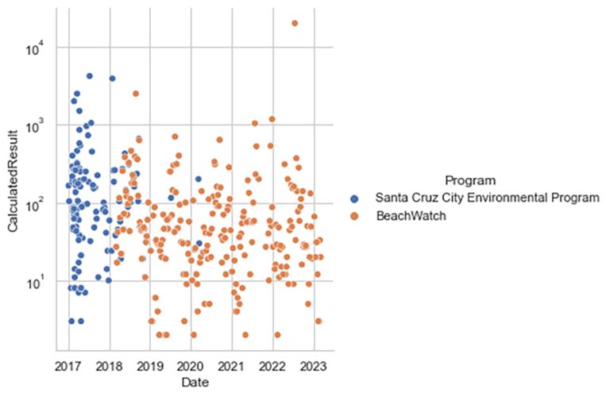
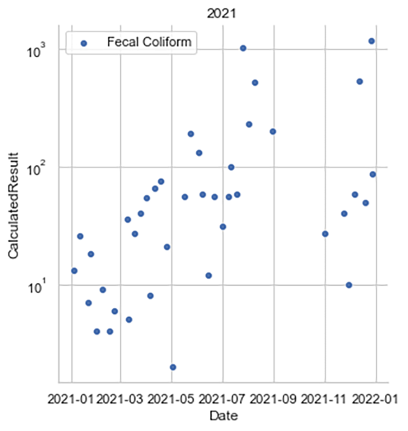
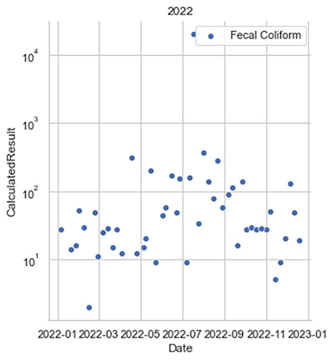
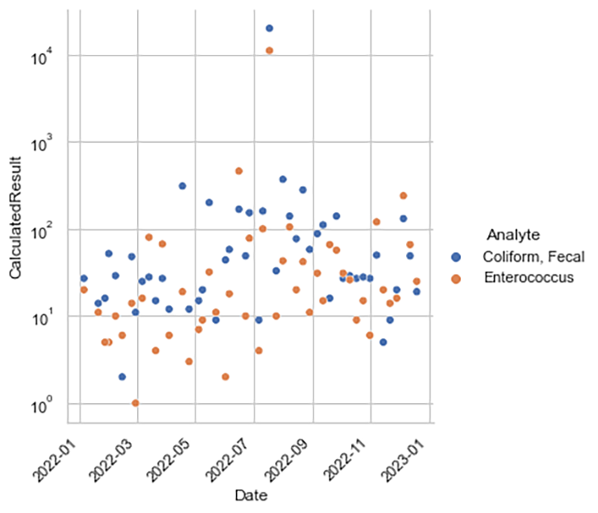
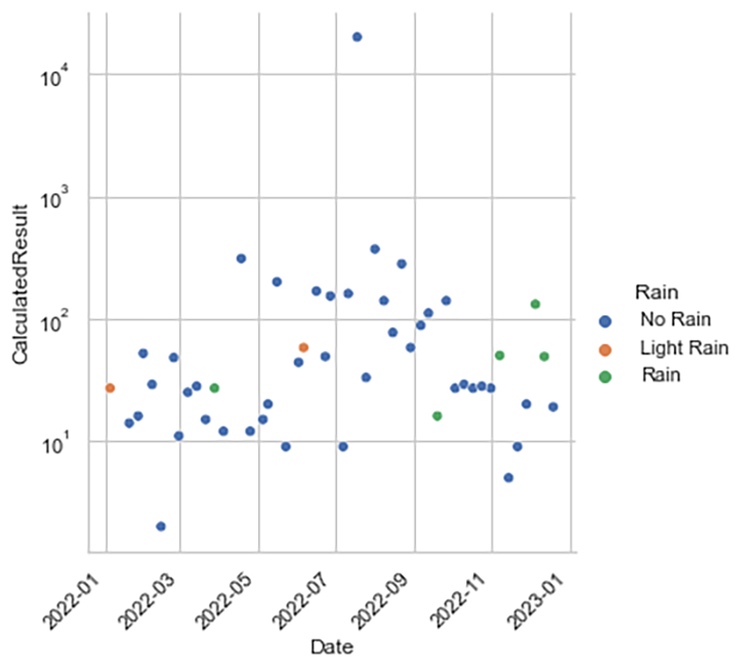
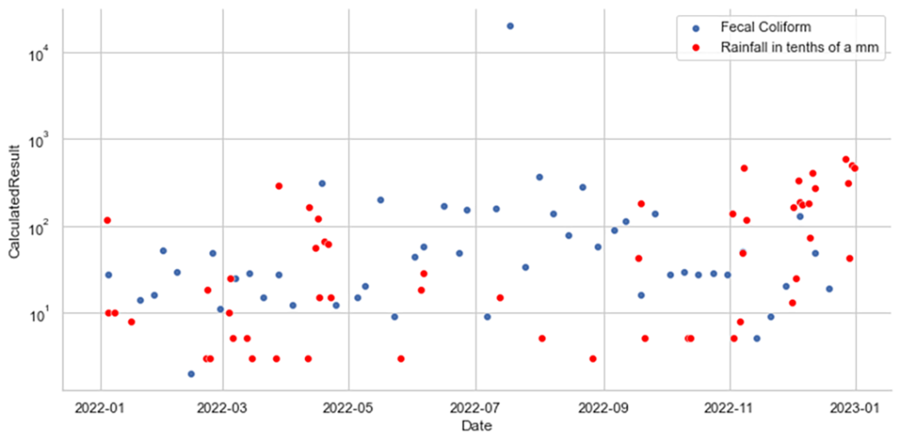

# Water Quality Exploration
A data science exercise, around water quality using Python and Pandas. Moved from a 2023-08-05 post on my blog

The second question to try to apply the learnings of the Python Data Science Handbook to was; What is the water quality like where I surf at Cowell’s beach in Santa Cruz, CA? The water data was much messier and harder to get good examples or descriptions for.

Some notes on the water quality data that I found:
* You can typically choose from measures of Fecal coliform (which is what I decided to use), E. Coli, or Total coliform
* There were a couple measuring sites near where I surf and a nice map at: https://mywaterquality.ca.gov/safe_to_swim/interactive_map/
* The data seems to be recorded every few days on an uneven schedule
* The data only went back to 2017 for the location I chose
* There were some obviously bad dates that had to be cleaned out
* The E. Coli is not good, but is mostly used as a proxy for the level of fecal coliform, which is supposedly the thing that would actually make you sick in this case

So naturally, we start with just a graph of the level over time. Note that the Y axis is logarithmic and that the level is “colonies/100ml”

So there are more safe times than not safe, but I don’t think I see much of a pattern otherwise. There seem to be two collection groups, what’s going on there?

Looks like one program replaced the other over time. Overlapping measures seem close to each other, which bodes well for data quality. Maybe there is a seasonal pattern? Let’s look at just two years, each on their own

I don’t see any seasonal pattern, which is odd because I thought it should be correlated with rain, which there should be more in the winter, right? Maybe Fecal Coliform is tough to measure and I should look at E. Coli?

They look correlated, but not different enough to provide a new pattern. Maybe I really need rainfall data to go along with this. So I learned a few things about rainfall data
* It was very difficult to find a good example for this
* ChatGPT did not give a good example, but did help start a better search
* NOAA has an API and you can request a free token to get data
* This info let ChatGPT give a better answer to a better question, but it gave a bad city identifier
* There were too many stations in CA to just list them all, given the 1000 result return cap
* I was eventually able to filter by zip code and get station names
* Then you can’t just query a nearby station, because they don’t all have data for the time I needed. So I had to loop through the list of them and return days they did have to find one that would work
* Finally, the units are in tenths of a millimeter, so you need to decide what real rainfall is. I used <5 = No Rain, 5-29 = Light Rain and >29 = Rain
So below is fecal coliform amounts, colored to show the amount of rain

Still seems like there is no pattern. What if rain the day before has an impact on the next day? Let’s plot both the rainfall amount and the fecal coliform amount and see what we can. I lucked out here as the log scaled worked pretty well for both values and many of the rain values are zero and off the bottom of the log scale

Either there is no correlation or we need better timed water tests. There is finer rainfall data, so we could try to fit some ML model to each test point using that, but there are some high measures with no preceding rain, so would not expect much to come of that. I ended without a great explanation of the driver and will just surf when I can and not worry about it

[Code to get the rainfall data](get_rain_data.py)

[Code the do the water quality analysis](wq_analysis.py)
